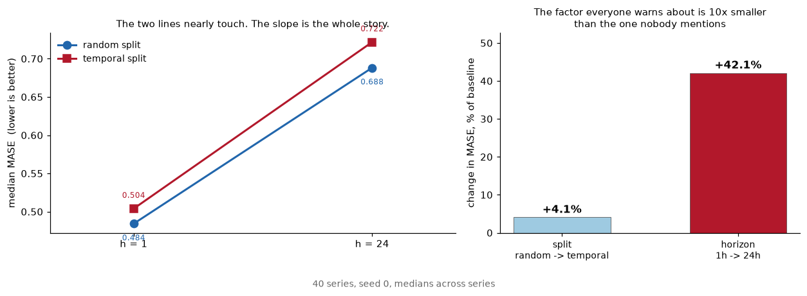
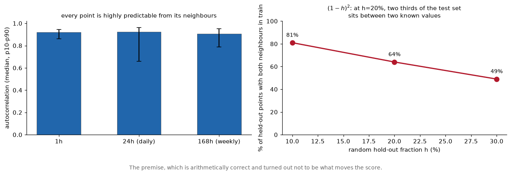
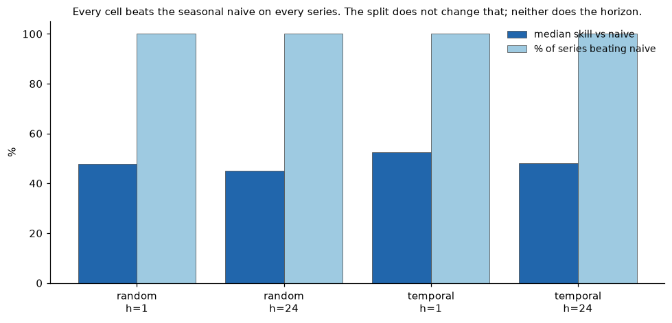
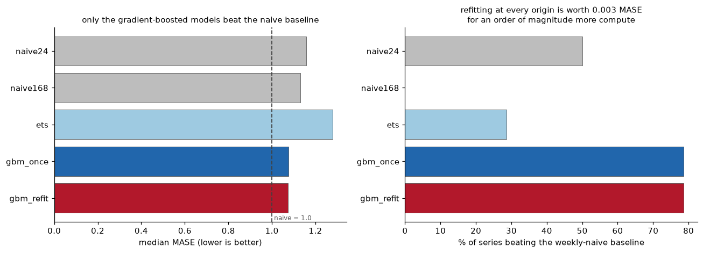

# What actually inflates a forecasting score, the split, or the horizon?

[](https://github.com/aghasalim/forecast-backtest/actions/workflows/ci.yml)
[](LICENSE)

---

## Abstract

The standard warning about evaluating time-series models on a random split is
that it leaks: holding out a random fraction `h` leaves both temporal neighbours
of a held-out point in training with probability `(1-h)^2`, which is 64% at the
usual `h = 0.2`. This project was built to demonstrate that, and measured it to be
the smaller of two effects. Holding model, features and rows fixed and varying one
factor at a time across 40 series, moving from a random to a temporal split costs
4.1% MASE, while extending the horizon from one hour to 24 costs 42.1%, ten times
more.

The interpolation arithmetic is correct; the conclusion drawn from it was not.
With strictly past-lag features the model never gets to interpolate, because it
only ever sees earlier values regardless of which rows are held out. What it does
get in both splits is the previous hour, and that is what the horizon takes away.
A second hypothesis, that refitting at every origin matters, was also measured
and also came out negative, at 0.003 MASE for an order of magnitude more compute.

**Contributions.** (i) A factorial measurement separating split from horizon on
the same series, features and seeds. (ii) Two negative results reported as
negative, with the reasoning that produced the wrong expectation left in
[NOTES.md](NOTES.md). (iii) A refit ablation showing origin-by-origin refitting is
not worth its cost here.

---

## 1. Introduction

Almost every forecasting tutorial does the same thing: shuffle the rows, hold
out 20%, report a small error. The standard warning is that this leaks, because
if you hold out a random fraction `h`, the chance that **both** neighbours of a
held-out point are still in training is `(1 - h)²`, **64%** at the usual
`h = 0.2`. Two thirds of your test set sits between two known values.

I built this project to demonstrate that. **Then I measured it, and it is not
the main problem.**

Holding the model, features and rows fixed and changing one factor at a time:

| what changes | effect on MASE |
|---|---|
| random split → temporal split (h=1) | **+4.1%** |
| horizon 1h → 24h (random split) | **+42.1%** |



Left is the full 2×2. The two split lines nearly overlap at both horizons, and
they climb together, the leakage everyone warns about is the small gap between
them, while the thing that actually decides the score is how far ahead you are
asked to predict. Redrawn from `reports/backtest.json` by `python -m fb.figures`,
so it cannot drift from the table above it. The metrics themselves are
recomputed independently in `verify/`, by other routes than the numpy path that
produced them, and CI fails if any recomputation disagrees.

The split moves the score by 4%. The forecast horizon moves it by 42%, ten
times more. The interpolation arithmetic is correct and the conclusion I drew
from it was wrong: with strictly past-lag features the model never gets to
interpolate, because it only ever sees earlier values no matter which rows are
held out. What it does get, in both splits, is *the previous hour*, and that
is what makes the task easy.

So the honest warning is not "don't shuffle your time series." It is **"a
1-step-ahead score is not evidence you can forecast 24 hours out,"** and that
holds whichever way you split.

## 2. The data
This is the premise the project was built on, and it is arithmetically fine.
351 meters record hourly kWh from 2011 to 2015, which is 10.3M rows after
preparation. Consecutive hours correlate at 0.92, so at a 20% hold-out 64% of
test points really do sit between two training points. The arithmetic holds.
What it does not do is make the split the factor that decides the score.




Full detail in [notes/METHODS.md](notes/METHODS.md#2-the-data).
## 3. The full grid
MASE compares against a within-series scaling, which does not by itself say the model is useful.
The four cells run from 0.4843 MASE (random split, one hour ahead) to 0.7217
(temporal split, 24 hours ahead), a spread of 49%, and the horizon accounts for
almost all of it. Every cell beats the seasonal naive on 100% of the 40 series,
so this is a comparison between working configurations, not between a working
one and a broken one.



Full detail in [notes/METHODS.md](notes/METHODS.md#3-the-full-grid).
### The metric I had to fix first

My first version divided by seasonal naive computed **on the test rows**. At
h=24 that baseline uses a lag of 191 instead of 168, so it degrades along with
the model, and h=24 came out looking *better* than h=1, which is impossible.
The yardstick was moving with the thing being measured. MASE with a fixed
in-sample denominator removes it. The numbers above are from the corrected
metric; the confounded ones are in [NOTES.md](NOTES.md).

## 4. Real models, under a rolling origin
Only the gradient-boosted models beat the weekly-naive baseline, on 79% of series.
Across 14 meters and 28 origins each, gradient boosting lands at 1.0771 median
MASE and ETS at 1.2791, which is worse than repeating last week. Every model
here scores above 1.0. That is not because they lose to seasonal naive on the
same rows, it is because the final 28 days are harder than the training period
the denominator was computed on.



Full detail in [notes/METHODS.md](notes/METHODS.md#4-real-models-under-a-rolling-origin).
## 5. Refitting is worth almost nothing here
This section asks whether a single temporal cut is optimistic compared to refitting as time advances.
Refitting at all 28 origins scores 1.0741 median MASE against 1.0771 for fitting
once and letting the model age. That is 0.0030 MASE, or 0.3%, for 28 times the
compute. A month is not long enough for a model built on recent lag features to
go stale, so the retraining pipeline can be dropped here without losing anything
measurable.

Full detail in [notes/METHODS.md](notes/METHODS.md#5-refitting-is-worth-almost-nothing-here).
### These numbers are not comparable to the grid above

The grid in section 3 scored the last 20% of every series (about 291 days) with a
MASE denominator from the first 80%. Section 4 scores the last 28 days with a
denominator from everything before them, on 14 meters rather than 40. Different
window, different denominator, different sample. Comparing 0.72 against 1.08 and
concluding something changed would be wrong, the split/horizon comparison is
internally consistent, and so is the model comparison, but not with each other.

## 6. Two other things measured now because they constrain what comes later
**Series scales span 5,332×**: from 15.6 to 82,974 mean kWh. An MAE averaged
over series would report on the largest few meters and nothing else, so a
scale-free error is a requirement here. The second measurement is that daily and
weekly autocorrelation are both about 0.9, which fixes the bar at seasonal
naive, predicting this hour with the same hour last week, rather than at
anything simpler.

Full detail in [notes/METHODS.md](notes/METHODS.md#6-two-other-things-measured-now-because-they-constrain-what-comes-later).
## 7. A data decision that would have moved every result

Many meters were installed partway through the record and log exactly `0` until
then. That is absence of a meter, not zero demand, and averaging it into a
baseline drags the baseline down invisibly.

Each series is trimmed to its first non-zero reading. The **median trimmed
prefix is 8,760 hours**, half the meters were installed a full year in. Interior
zeros are kept, because those are real readings; there is a self-check asserting
exactly that distinction.

## 8. Reproducibility

```bash
uv sync
curl -L -o data/electricity.zip \
  https://archive.ics.uci.edu/static/public/321/electricityloaddiagrams20112014.zip
unzip -q data/electricity.zip -d data/

uv run python src/fb/prepare.py     # 711 MB text -> 52.8 MB parquet
uv run python src/fb/eda.py         # -> reports/eda.{json,png}
uv run python src/fb/backtest.py    # the two-factor grid -> reports/backtest.json
uv run python src/fb/models.py      # rolling-origin model comparison (~30 min)
uv run streamlit run app.py         # the demo
```

Self-checks, which assert each function is right on signals whose answer is
known, a pure 24-period sine must autocorrelate at ~1 at lag 24 and ~−1 at lag
12, and need no dataset:

```bash
uv run python src/fb/prepare.py --self-check
uv run python src/fb/eda.py --self-check
uv run python src/fb/backtest.py --self-check
uv run python src/fb/models.py --self-check
uv run python src/fb/harness.py --self-check   # proves a cheating forecaster cannot cheat
```

## 9. Roadmap
- [x] **1, Data and the deciding statistic.** Prepare 351 series, measure the autocorrelation that makes random splits leak, and the scale spread that makes MASE mandatory.

Everything on the roadmap is done. Section 3 is the two-factor grid, where the
horizon beat the split by ten times and the premise the project started from
turned out to be wrong. Section 4 is the five-model rolling-origin comparison on
14 meters, and section 5 is the refit ablation at +0.3% MASE for 28 times the
compute. The rest is the prefix-slice backtester in `src/fb/harness.py` with the
demo, and the decision trail in [NOTES.md](NOTES.md) with both refuted premises
left in.

Full detail in [notes/METHODS.md](notes/METHODS.md#9-roadmap).
## 10. What I would do next
**Longer staleness window.** Refitting bought 0.3% over 28 days. A year is the
honest test, because that is long enough for a meter's own behaviour to drift.
After that, a classical model that can hold a 168-hour cycle would be the fair
comparator, since ETS lost with only 24-period seasonality. Third is per-series
reporting: the 79% figure implies 21% of meters where boosting loses, and the
median hides them.

Full detail in [notes/METHODS.md](notes/METHODS.md#10-what-i-would-do-next).
## 11. Stack

Python 3.12, pandas, NumPy, statsmodels, scikit-learn, matplotlib, PyArrow.
Managed with `uv`, linted with `ruff`.

## 12. Data source

[UCI ElectricityLoadDiagrams20112014](https://archive.ics.uci.edu/dataset/321/electricityloaddiagrams20112014),
CC BY 4.0. My code is MIT.

## References

Three sources, one per moving part: where the error measure comes from, where
the models come from, and why the evaluation rolls forward instead of shuffling.

- **Hyndman, Koehler. Another look at measures of forecast accuracy. International Journal of Forecasting 22, 2006.** MASE, the scale free error measure used throughout.
- **Hyndman, Athanasopoulos. Forecasting: Principles and Practice, 3rd edition. OTexts, 2021.** ETS and ARIMA, and the rolling origin evaluation this implements.
- **Bergmeir, Benítez. On the use of cross-validation for time series predictor evaluation. Information Sciences 191, 2012.** why ordinary cross validation is wrong here.
