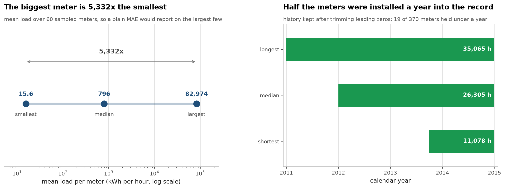

# How you split the data decides the score — forecasting, backtested honestly

Built by a third-year Applied Computer Science (AI) student.

> **Status: in progress.** Milestone 1 is done — the data is prepared and the
> one statistic that decides the whole evaluation protocol is measured. The
> backtest comparison is next. Every number below came out of the code in this
> repo.

Almost every forecasting tutorial does the same thing: shuffle the rows, hold
out 20%, fit a model, report a small error, and conclude the model works. On
time series that procedure does not measure forecasting at all, and the problem
is not subtle — it is arithmetic you can do before writing a model.

If you hold out a random fraction `h` of the rows, the chance that **both**
neighbours of a held-out point are still in the training set is `(1 - h)²`. At
the usual `h = 0.2`, that is **64%**. So two thirds of your test set is not a
forecasting problem, it is an interpolation problem — guess a value that sits
between two known values, taken an hour apart.

Whether that is easy depends on one number.

## The number

351 electricity meters, hourly, 2011–2015, 10.3M rows
([UCI ElectricityLoadDiagrams](https://archive.ics.uci.edu/dataset/321/electricityloaddiagrams20112014)).

| lag | median autocorrelation | p10 |
|---|---|---|
| **1 hour** | **0.9213** | 0.8605 |
| 24 hours (daily) | 0.9248 | 0.6578 |
| 168 hours (weekly) | 0.9059 | 0.7886 |

Consecutive hours correlate at **0.92**. Interpolating between two values that
similar is close to free, so a random split hands the model an easy problem and
returns a flattering number for it.



## Two other things measured now because they constrain what comes later

**Series scales span 5,332×** — from 15.6 to 82,974 mean kWh. An MAE averaged
across series is therefore a report on the largest few meters and nothing else.
Scale-free errors (MASE) are a requirement here, not a stylistic preference.

**Daily and weekly autocorrelation are both ~0.9**, which sets the honest
baseline. Beating a naive forecast that ignores seasonality proves nothing; the
bar is *seasonal naive* — predict this hour with the same hour last week. In
forecasting it is very common for elaborate models to lose to it, and I would
rather find that out in milestone 2 than discover it after building something.

## A data decision that would have moved every result

Many meters were installed partway through the record and log exactly `0` until
then. That is absence of a meter, not zero demand, and averaging it into a
baseline drags the baseline down invisibly.

Each series is trimmed to its first non-zero reading. The **median trimmed
prefix is 8,760 hours** — half the meters were installed a full year in. Interior
zeros are kept, because those are real readings; there is a self-check asserting
exactly that distinction.

## Reproduce

```bash
uv sync
curl -L -o data/electricity.zip \
  https://archive.ics.uci.edu/static/public/321/electricityloaddiagrams20112014.zip
unzip -q data/electricity.zip -d data/

uv run python src/fb/prepare.py     # 711 MB text -> 52.8 MB parquet
uv run python src/fb/eda.py         # -> reports/eda.{json,png}
```

Self-checks, which assert each function is right on signals whose answer is
known — a pure 24-period sine must autocorrelate at ~1 at lag 24 and ~−1 at lag
12 — and need no dataset:

```bash
uv run python src/fb/prepare.py --self-check
uv run python src/fb/eda.py --self-check
```

## Roadmap

- [x] **1 — Data and the deciding statistic.** Prepare 351 series, measure the
      autocorrelation that makes random splits leak, and the scale spread that
      makes MASE mandatory.
- [ ] **2 — The demonstration.** The same model under a random split and under
      rolling-origin backtesting, against seasonal naive. Expect the random
      split to look far better and be worthless.
- [ ] **3 — Models.** Seasonal naive, exponential smoothing, gradient boosting
      on lag features — all under the honest protocol.
- [ ] **4 — Prediction intervals.** Not just point forecasts: intervals whose
      empirical coverage is measured, since a nominal 95% interval that covers
      70% of the time is worse than no interval.
- [ ] **5 — Deployment.** Backtesting harness plus a demo.
- [ ] **6 — Docs.** Write-up and decision trail.

## Stack

Python 3.12, pandas, NumPy, statsmodels, scikit-learn, matplotlib, PyArrow.
Managed with `uv`, linted with `ruff`.

## Data

[UCI ElectricityLoadDiagrams20112014](https://archive.ics.uci.edu/dataset/321/electricityloaddiagrams20112014),
CC BY 4.0. My code is MIT.
