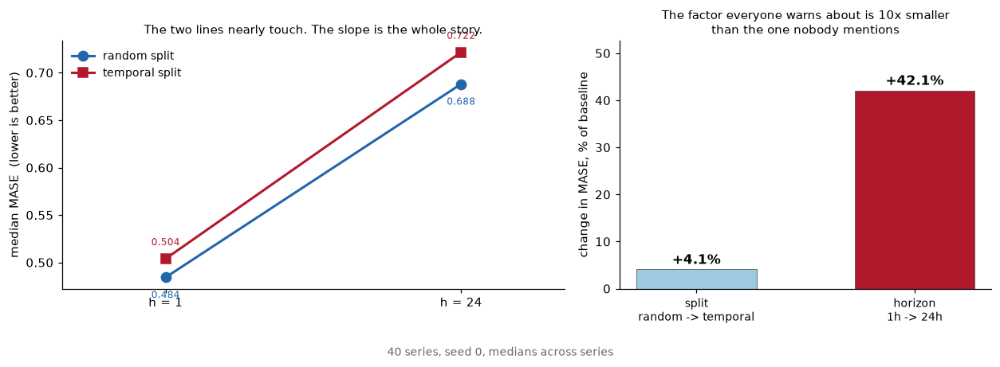
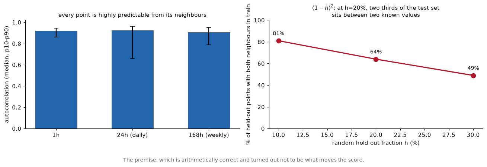
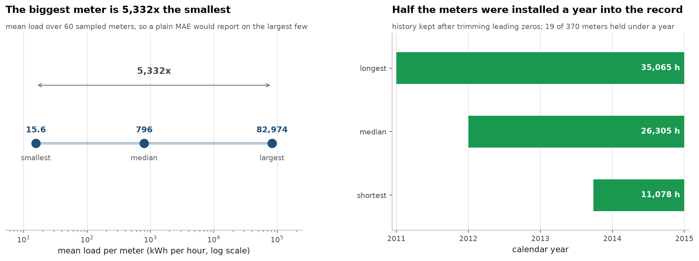
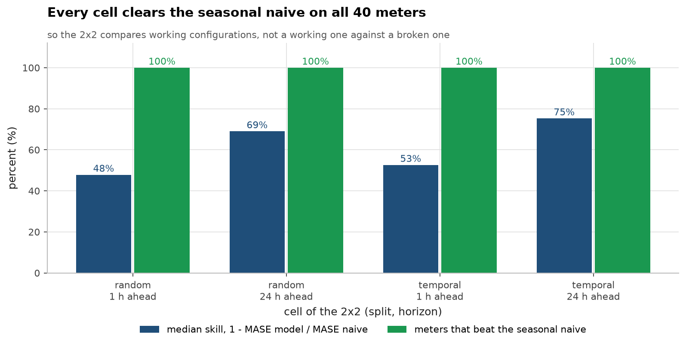
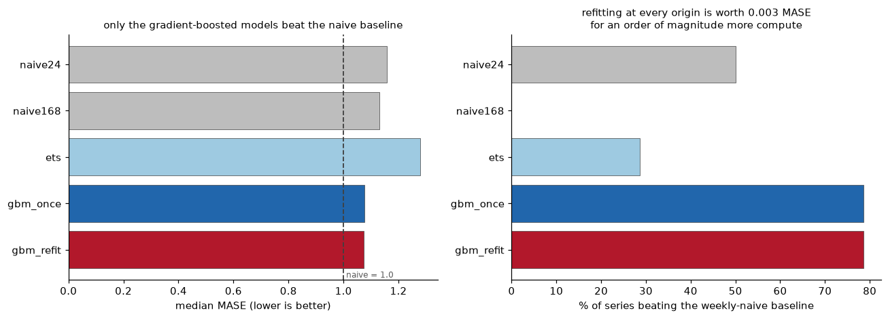

# What actually inflates a forecasting score, the split, or the horizon?

[](https://github.com/aghasalim/forecast-backtest/actions/workflows/ci.yml)
[](LICENSE)
[](https://doi.org/10.5281/zenodo.23003631)

---

## Abstract

People usually warn that a random split leaks when you evaluate a time-series
model. If you hold out a random fraction `h`, both neighbours of a held-out point
stay in training with probability `(1-h)^2`. At the usual `h = 0.2` that's 64%. I
started this project to show that, and it turned out to be the smaller of two
effects. I kept the model, features and rows fixed and changed one thing at a time
across 40 series. Going from a random to a temporal split cost 4.1% MASE. Going from
a one hour horizon to 24 hours cost 42.1%, about ten times more.

The interpolation maths is right, but I drew the wrong conclusion from it. With
strictly past-lag features the model never gets to interpolate. It only ever sees
earlier values, whichever rows are held out. In both splits it gets the previous
hour, and that's what a longer horizon takes away. I also tested whether refitting
at every origin matters. It didn't, at 0.003 MASE for an order of magnitude more
compute.

What's in here: a factorial run that separates split from horizon on the same
series, features and seeds. Two negative results, written up as negative, with my
wrong reasoning left in [NOTES.md](NOTES.md). And a refit ablation showing that
refitting at every origin isn't worth the cost here.

---

## 1. Introduction

A lot of forecasting tutorials shuffle the rows, hold out 20% and report a small
error. The usual warning is that this leaks. If you hold out a random fraction `h`,
the chance that both neighbours of a held-out point are still in training is
`(1 - h)²`, which is 64% at the usual `h = 0.2`. So about two thirds of the test set
sits between two known values.

I built this project to show that. Then I measured it, and it isn't the main
problem.

I kept the model, features and rows fixed and changed one factor at a time.

| what changes | effect on MASE |
|---|---|
| random split → temporal split (h=1) | **+4.1%** |
| horizon 1h → 24h (random split) | **+42.1%** |



The left panel is the full 2×2. The two split lines nearly overlap at both
horizons and climb together. The leakage people warn about is the small gap between
them. What really decides the score is how far ahead you have to predict. The
figure is redrawn from `reports/backtest.json` by `python -m fb.figures`, so it
can't drift from the table above it. I also recompute the metrics in `verify/`
without going through the numpy code that produced them, and CI fails if any of
them disagree.

The split moves the score by 4%. The horizon moves it by 42%. I was wrong about
why. With strictly past-lag features the model never gets to interpolate, since it
only sees earlier values whichever rows are held out. In both splits it gets the
previous hour, and that's what makes the task easy.

So I'd change the warning. Shuffling your time series matters less than I thought.
What matters more is that a 1-step-ahead score doesn't show you can forecast 24
hours out, and that's true whichever way you split.

## 2. The data
This is where the project started, and the maths here is fine. There are
351 meters recording hourly kWh from 2011 to 2015, which comes to 10.3M rows after
preparation. Consecutive hours correlate at 0.92. So with a 20% hold-out, 64% of
test points really do sit between two training points. That part holds. It just
doesn't make the split the thing that decides the score.




Full detail in [notes/METHODS.md](notes/METHODS.md#2-the-data).
## 3. The full grid
MASE scales against each series itself, so a low MASE alone doesn't tell you the
model is useful. The four cells go from 0.4843 MASE (random split, one hour ahead)
to 0.7217 (temporal split, 24 hours ahead). That's a spread of 49%, and nearly all
of it comes from the horizon. Every cell beats the seasonal naive on 100% of the 40
series, so I'm comparing setups that all work. The seasonal naive is the same hour
one week back at both horizons, since that value is already known a day ahead.



Full detail in [notes/METHODS.md](notes/METHODS.md#3-the-full-grid).
### The metric I had to fix first

My first version divided by a seasonal naive computed on the test rows. At
h=24 that baseline uses a lag of 191, not 168, so it gets worse along with
the model. As a result h=24 came out looking better than h=1, which can't be right.
I was measuring with a ruler that moved with the thing I was measuring. Using MASE
with a fixed in-sample denominator fixed it. The head-to-head comparison against
seasonal naive kept the lag-191 baseline until 2026-10-10. Now it uses lag 168 at
h=24 too. That moved the median 24h naive MASE from about 1.5 to about 0.97, and
every cell still beats it on all 40 series. The numbers above use the corrected
metric. The broken ones are in [NOTES.md](NOTES.md).

## 4. Real models, under a rolling origin
Only the gradient-boosted models beat the weekly-naive baseline, on 79% of series.
I used 14 meters and 28 origins each. Gradient boosting gets 1.0771 median MASE.
ETS gets 1.2791, which is worse than just repeating last week. Every model here
scores above 1.0. They don't lose to seasonal naive on the same rows, though. The
last 28 days are just harder than the training period the denominator came from.



Full detail in [notes/METHODS.md](notes/METHODS.md#4-real-models-under-a-rolling-origin).
## 5. Refitting is worth almost nothing here
I wanted to know if one temporal cut looks better than refitting as time moves on.
Refitting at all 28 origins scores 1.0741 median MASE. Fitting once and letting the
model age scores 1.0771. The gap is 0.0030 MASE, or 0.3%, for 28 times the compute.
A month isn't long enough for a model built on recent lag features to go stale. So
here I could drop the retraining pipeline and not lose anything I can measure.

Full detail in [notes/METHODS.md](notes/METHODS.md#5-refitting-is-worth-almost-nothing-here).
### These numbers are not comparable to the grid above

The grid in section 3 scored the last 20% of every series (about 291 days), with a
MASE denominator from the first 80%. Section 4 scores the last 28 days, with a
denominator from everything before them, on 14 of the 40 meters. The window, the
denominator and the sample all differ. So don't compare 0.72 with 1.08 and decide
something changed. Each comparison is fine on its own, but you can't mix them.

## 6. Two other things measured now because they constrain what comes later
The series scales span 5,332×, going from 15.6 to 82,974 mean kWh. If you averaged
MAE over series, it would only tell you about the biggest few meters. So I needed a
scale-free error. I also found that daily and weekly autocorrelation are both about
0.9. That sets the bar at seasonal naive, which predicts this hour with the same
hour last week.

Full detail in [notes/METHODS.md](notes/METHODS.md#6-two-other-things-measured-now-because-they-constrain-what-comes-later).
## 7. A data decision that would have moved every result

Many meters were installed partway through the record and log exactly `0` until
then. That means there was no meter yet, not zero demand. If you average those
zeros into a baseline, it quietly drags the baseline down.

So I trim each series to its first non-zero reading. The median trimmed prefix is
8,760 hours, so half the meters went in a full year late. I keep zeros in the
middle of a series because those are real readings, and a self-check makes sure
the code tells the two apart.

## 8. Reproducibility

```bash
uv sync
curl -L -o data/electricity.zip \
  https://archive.ics.uci.edu/static/public/321/electricityloaddiagrams20112014.zip
unzip -q data/electricity.zip -d data/

uv run python src/fb/prepare.py     # 711 MB text -> 52.8 MB parquet
uv run python src/fb/eda.py         # -> reports/eda.{json,png}
uv run python src/fb/backtest.py    # the two-factor grid -> reports/backtest.json
uv run python src/fb/models.py      # rolling-origin model comparison (~30 min)
uv run streamlit run app.py         # the demo
```

The self-checks test each function on signals where I know the answer. For
example, a pure 24-period sine has to autocorrelate at ~1 at lag 24 and ~−1 at lag
12. They don't need the dataset.

```bash
uv run python src/fb/prepare.py --self-check
uv run python src/fb/eda.py --self-check
uv run python src/fb/backtest.py --self-check
uv run python src/fb/models.py --self-check
uv run python src/fb/harness.py --self-check   # proves a cheating forecaster cannot cheat
```

## 9. Roadmap
- [x] **1, Data and the deciding statistic.** Prepare 351 series, measure the autocorrelation that makes random splits leak, and the scale spread that makes MASE mandatory.

I've finished everything on the roadmap. Section 3 is the two-factor grid, where
the horizon beat the split by ten times and my starting premise turned out wrong.
Section 4 compares five models with a rolling origin on 14 meters. Section 5 is the
refit ablation, +0.3% MASE for 28 times the compute. There's also the prefix-slice
backtester in `src/fb/harness.py` with the demo. My notes on each decision are in
[NOTES.md](NOTES.md), and I left both wrong premises in.

Full detail in [notes/METHODS.md](notes/METHODS.md#9-roadmap).
## 10. What I would do next
First I'd try a longer staleness window. Refitting bought 0.3% over 28 days. A year
would be a better test, since that's long enough for a meter's own behaviour to drift.
After that I'd want a classical model that can hold a 168-hour cycle, because ETS
only had 24-period seasonality when it lost. I'd also like per-series reporting. The
79% figure means there are 21% of meters where boosting loses, and the median hides
them.

Full detail in [notes/METHODS.md](notes/METHODS.md#10-what-i-would-do-next).
## 11. Stack

Python 3.12, pandas, NumPy, statsmodels, scikit-learn, matplotlib, PyArrow.
Managed with `uv`, linted with `ruff`.

## 12. Data source

[UCI ElectricityLoadDiagrams20112014](https://archive.ics.uci.edu/dataset/321/electricityloaddiagrams20112014),
CC BY 4.0. My code is MIT.

## References

I leaned on three sources. One for the error measure, one for the models, and one
for why the evaluation rolls forward in time.

- **Hyndman, Koehler. Another look at measures of forecast accuracy. International Journal of Forecasting 22, 2006.** MASE, the scale free error measure used throughout.
- **Hyndman, Athanasopoulos. Forecasting: Principles and Practice, 3rd edition. OTexts, 2021.** ETS and ARIMA, and the rolling origin evaluation this implements.
- **Bergmeir, Benítez. On the use of cross-validation for time series predictor evaluation. Information Sciences 191, 2012.** why ordinary cross validation is wrong here.
